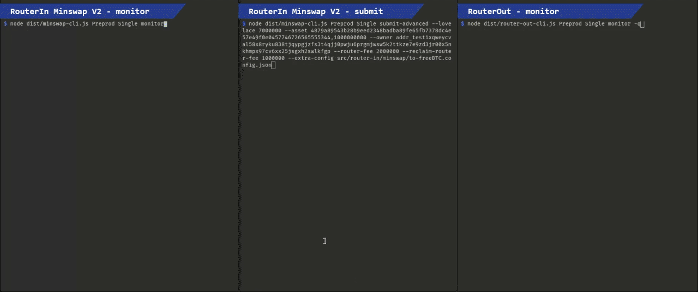

# cardano-cross-router

Cardano cross router service to support crosschain to Cardano policy.

## Code Structure

-   contract-cross
    -   crosschain contract for Cardano and EVM.
-   contract-router
    -   router contract for Cardano.
-   router-agent
    -   router agent service to invoke Cardano transactions for router contract.

## How to use

## Prerequisites

Ensure you have the following installed on your system:

-   [Node.js](https://nodejs.org/) (latest stable version recommended)
-   [pnpm](https://pnpm.io/installation)
-   [Docker](https://www.docker.com/)
-   [Docker Compose](https://docs.docker.com/compose/)

### Deploy locally

1. Install dependencies:

    ```sh
    pnpm install
    ```

2. Build the project:

    ```sh
    pnpm run build
    ```

3. Run the project:

    ```sh
    pnpm start
    ```

4. Adjust `pollingInterval` in both `src/router-in/minswap/config.ts` and
   `src/router-out/config.ts` as desired (only applies to the `monitor` endpoint
   and determines how often each of the scripts are queried)

5. Currently this application uses a combination of Blockfrost and Kupmios,
   therefore you'll need to set 4 environment variables:

```sh
export SEED_PHRASE="agent's wallet seed phrase"

export BLOCKFROST_KEY="blockfrost api key"

export KUPO_URL="authenticated kupo instance url"

export OGMIOS_URL="authenticated ogmios instance url"
```

5. Available commands are:

-   For monitoring the contracts and routing incoming requests, use one of
    these two commands:

```sh
# For Minswap V2 RouterIn instance to Minswap:
node dist/minswap-cli.js Preprod Single monitor

# For RouterOut to Treasury:
node dist/router-out-cli.js Preprod Single monitor
```

-   For reclaiming an order Minswap V2 instance of RouterIn, use:

```sh
node dist/minswap-cli.js Preprod Single monitor --reclaim
```

-   For cancelling an order stuck at Minswap V2, use this command:

```sh
node dist/minswap-cli.js Preprod Single cancel-one-order
```

-   If the canceller script is not registered, register it with `register-canceller-validator`:

```sh
node dist/minswap-cli.js Preprod Single register-canceller-validator
```

-   Get command line guide for submitting a swap request with `-h`:

```sh
node dist/minswap-cli.js Preprod Single submit-advanced -h
```

Note the minimum Lovelace count for each request is `4000000` (4₳) plus the
maximum between `router-fee` and `reclaim-router-fee`, plus `routerOutRouterFee` specified
in the `extra-config` JSON file (which is the router agent's fee for carrying
out the transaction from RouterOut to treasury).

So for example, with a `router-fee` of 2₳, and a `reclaim-router-fee` of 1₳, and
also a `routerOutRouterFee` of 1₳, the minimum required ADA will be 7₳.

The `--owner` must also always be set to the treasury's address in order to
allow it reclaim an order at RouterIn.

### Deploy with Docker Compose

1. Build the Docker image:

    ```sh
    make docker-build
    ```

2. Start the Docker container:

    ```sh
    make docker-up
    ```

3. View logs:

    ```sh
    make docker-logs
    ```

4. Exec into router agent and run desired commands:

    ```sh
    docker exec -it router-agent /bin/sh

    ...

    /usr/src/app $ node dist/minswap-cli.js Preprod Single monitor
    ```

5. Stop the Docker container:

    ```sh
    make docker-down
    ```

## Sample Transactions – `FreeUSD` to `FreeBTC`

1. Request transaction, sent by the user to `RouterIn`, 7₳ plus
   some `FreeUSD` sample tokens (0.191593₳ tx fees):

    [`3542e99cec1d7f065745c7a0fff057a1c3b05e03aa6ea6d4905cf0a55b2608b6`](https://preprod.cardanoscan.io/transaction/3542e99cec1d7f065745c7a0fff057a1c3b05e03aa6ea6d4905cf0a55b2608b6)

2. Route transaction, performed by an agent, from `RouterIn` to Minswap V2,
   order to swap `FreeUSD` to `FreeBTC` (agent received 1.346313₳, and 0.653687₳
   was spent for the tx fees):

    [`6a0e737673390eedac572384a50b75077aa0781861ad802c984ff779018de9cf`](https://preprod.cardanoscan.io/transaction/6a0e737673390eedac572384a50b75077aa0781861ad802c984ff779018de9cf)

3. Batcher transaction, performed by a Minswap batcher, from Minswap V2
   to `RouterOut` (0.680608₳ tx fees, covered by the batcher):

    [`8bf963c73ec7fe5b9a557e1925ce8d2207dc72f2f6dd6e6709ca1167d4e086de`](https://preprod.cardanoscan.io/transaction/8bf963c73ec7fe5b9a557e1925ce8d2207dc72f2f6dd6e6709ca1167d4e086de)

4. Route transaction, performed by an agent, from `RouterOut` to Wanchain
   treasury, burning all `FreeBTC` in the UTxO (agent received 0.622404₳,
   and 0.377596₳ was spent for the tx fees):

    [`c777679bdd9f34e988479e9f635c3a05897155e43652c649ea3522890912ae38`](https://preprod.cardanoscan.io/transaction/c777679bdd9f34e988479e9f635c3a05897155e43652c649ea3522890912ae38)

5. Reclaim transaction, performed by an agent, from `RouterIn` to Wanchain
   treasury, burning all `FreeUSD` in the UTxO (agent received 0.387342₳,
   and 0.612658₳ was spent for the tx fees):

    [`607104099429d0644ebdddd18dec0fa1f8c0f1cf617bfb7bbbedf1b237059d7b`](https://preprod.cardanoscan.io/transaction/607104099429d0644ebdddd18dec0fa1f8c0f1cf617bfb7bbbedf1b237059d7b)

6. Canceller validator's reward address registration:

    [`ae322906b982526e7a9662ce274dc7c22ccdb60add2433c22208b0c257cbbbe9`](https://preprod.cardanoscan.io/transaction/ae322906b982526e7a9662ce274dc7c22ccdb60add2433c22208b0c257cbbbe9)

7. Cancel a stuck order at Minswap V2 back to treasury:

    [`34cfa98a74467838722f37d7513efda8b75d3d9b088c28da1281c7f3c79d0754`](https://preprod.cardanoscan.io/transaction/34cfa98a74467838722f37d7513efda8b75d3d9b088c28da1281c7f3c79d0754)

8. Cancel an ADA-MIN swap order:

    [`6dcacd8044af38d8cdf08a760572bf278d96dbbe0e034bbc9ad658b43786eb03`](https://preprod.cardanoscan.io/transaction/6dcacd8044af38d8cdf08a760572bf278d96dbbe0e034bbc9ad658b43786eb03)

## Sample Run


